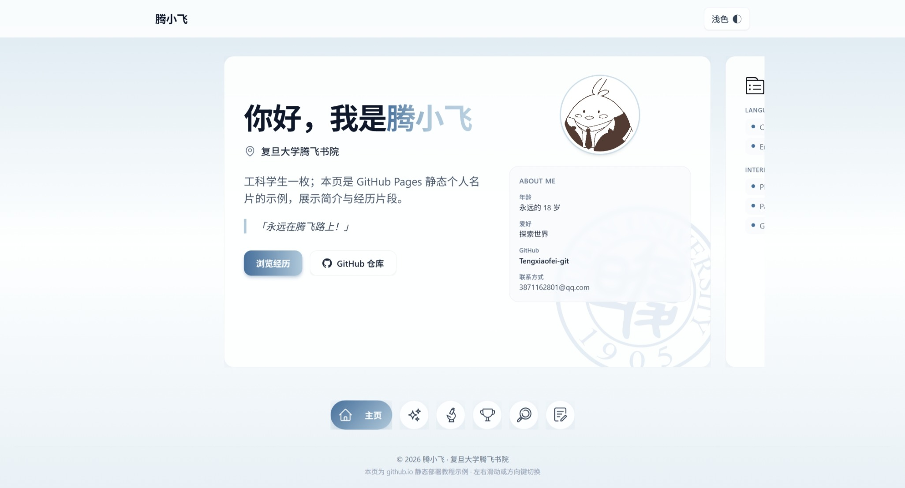

<h1 align="center">🪪 Zero-Code Personal Card for 腾飞er</h1>

<p align="center">
  <b>面向零基础学生的 GitHub Pages 个人名片模板</b> — 不用 Node、不用打包，改一个 <code>config.js</code> 就像填表一样换完整站文案与链接。
</p>

<p align="center">
  <a href="https://tengxiaofei-git.github.io/">🔗 Live Demo</a>
  ·
  <a href="https://github.com/Tengxiaofei-git/Tengxiaofei-git.github.io/fork">🍴 Fork</a>
  ·
  <a href="#quick-start">🚀 Quick Start</a>
</p>

<p align="center">
  <a href="https://github.com/Tengxiaofei-git/Tengxiaofei-git.github.io/stargazers"></a>
  <a href="https://github.com/Tengxiaofei-git/Tengxiaofei-git.github.io/network/members"></a>
  
  
</p>

> 💡 **Tip**  
> 日常只需要改 **`config.js`** 里的 `CONFIG`；`index.html` / `script.js` 一般不必动。
---

## ✨ Preview



---

## ✨ Features

- 🧾 **Zero-build**：无需 Node / npm，浏览器打开或静态托管即可
- 📝 **Single config**：文案、链接、技能列表、经历条目集中在 **`config.js`**
- 🧩 **Modular slides**：在 `slides` 里设 `enabled: false` 即可隐藏整页，不必删 HTML
- 🎨 **Theme tokens**：配色集中在 **`theme.css`**（`--tw-*`、语义色与阴影）
- 🌙 **Dark mode**：顶栏切换，偏好写入 `localStorage`
- 📱 **Carousel UX**：滑动 / 滚轮 / 方向键切换板块，底部圆点导航

---

<h2 id="quick-start">🚀 Quick Start</h2>

1. **Fork 本仓库**（或下载 ZIP 后推到你的 GitHub 仓库）。
2. **只改 `config.js`**：名字、学校、头像路径、各页列表、仓库链接等都在 `CONFIG` 里，改字符串和数组即可。
3. **打开 GitHub Pages**：Settings → Pages → Source 选主分支根目录，保存后等待 1～3 分钟，访问 `https://你的用户名.github.io/仓库名/`（规则以 [GitHub 文档](https://docs.github.com/pages) 为准）。

---

## 🛠 Customization

### 换头像（最常见）

1. 准备方形头像，例如 `avatar.jpg`。
2. 推荐放到 **`assets/`**，路径与 `config.js` 中一致，例如 `assets/avatar.jpg`。
3. 修改 `config.js`：

```js
profile: {
  avatar: 'assets/avatar.jpg',
  avatarAlt: '你的名字或照片说明',
  // ...
}
```

保存、提交、推送后，若已开 Pages，等待部署并 **强制刷新**（见 FAQ）。

### 隐藏某一整页（不删代码）

在 `config.js` 的 `slides` 里将对应项设为 `enabled: false`，例如：

```js
{ id: 'internship', enabled: false, navLabel: '实习经验', navAriaLabel: '实习经验' },
```

底部圆点会同步隐藏，轮播只在仍启用的页面间切换。

### 配色与主题

- 编辑 **`theme.css`** 顶部变量（如 `--palette-doc-accent`、`--tw-brand-*`）。
- 页面使用 **Tailwind CSS CDN** 与 **Google Fonts**；教学网或内网若拦截 CDN，样式或字体可能异常，需自行换成本地文件（进阶）。本仓库刻意保持 **零构建** 以降低上手成本。

### 进阶：人设示例（复制进 `CONFIG`）

```js
profile: {
  greetingLead: '你好，我是',
  displayName: '张小智',
  locationLine: '某某大学 · 人工智能专业',
  intro: '对深度学习和开源社区感兴趣，这是我的静态名片与项目入口。',
  quote: '「保持好奇，多写可运行的 demo。」',
  avatar: 'assets/avatar.jpg',
  avatarAlt: '张小智',
  aboutTitle: 'About Me',
  aboutRows: [
    { label: '方向', value: '机器学习 / 视觉' },
    { label: 'GitHub', value: 'zhangxiaozhi', href: 'https://github.com/zhangxiaozhi' },
    { label: '邮箱', value: 'hi@example.com', href: 'mailto:hi@example.com' }
  ]
},
skills: {
  title: '技能',
  columns: [
    {
      sections: [
        { heading: 'Language', items: ['Python', 'English'] },
        { heading: 'ML', items: ['PyTorch', 'NumPy'] }
      ]
    },
    {
      sections: [{ heading: 'Tools', items: ['Git', 'Linux', 'VS Code'] }]
    },
    {
      sections: [{ heading: 'Projects', items: ['课程大作业', 'Kaggle 入门'] }]
    }
  ]
}
```

---

## 📁 Project Structure

| 文件 | 谁改 | 说明 |
|------|------|------|
| **`config.js`** | **主要改这里** | 全站文案、链接、列表、是否显示某一整页幻灯片 |
| `index.html` | 一般不用动 | 页面骨架；内容由 `script.js` 根据配置填充 |
| `script.js` | 一般不用动 | 轮播、深色模式、将 `CONFIG` 写入 DOM |
| `theme.css` | 想换配色时改 | 颜色与阴影变量（与 Tailwind `--tw-*` 对齐） |
| `style.css` | 一般不用动 | 少量遗留样式 |
| `assets/` | 可选用 | 水印、小节标题旁图标等静态资源 |
| `assets/` | 推荐自建 | 头像、**README 预览图** `preview.png` 等 |

---

## ❓ FAQ

- **改了网页却没变**：浏览器或 CDN 缓存；试 `Ctrl+F5`、无痕窗口，或等待 GitHub Pages 部署完成。
- **图片裂了**：检查 `config.js` 路径与仓库内路径 **完全一致**（大小写、子目录、扩展名）。
- **主按钮跳错页**：检查 `links.primaryCtaSlideId` 是否为 `slides` 中某个 `id`，且该页未被 `enabled: false` 关闭。

---

## 🎯 Who is this for?

- 不会写前端、但想快速有一个 **可上线的个人主页**
- 使用 **GitHub Pages** 的学生与开发者
- 希望仓库 **像开源产品一样好读、好 Fork** 的模板作者

---

## 🤯 Why this template?

和其他静态站模板相比，这里刻意做到：

- ❌ 不需要 Node / npm  
- ❌ 不需要手写 HTML 结构  
- ❌ 不需要懂打包与前端工程化  

👉 **只改一个 `config.js`，就能拥有自己的 GitHub Pages 个人名片** — 同时保留轮播、深色模式与清晰的主题变量，方便以后进阶改样式。

---

## 🏫 项目来源说明

本项目为复旦大学腾飞书院学生自我管理委员会《github月推》系列的实践示例。

当前仓库为独立开源版本，不代表该组织的官方立场。

---

## 📄 License

**MIT License** © 2026 [Tengxiaofei-git](https://github.com/Tengxiaofei-git)
